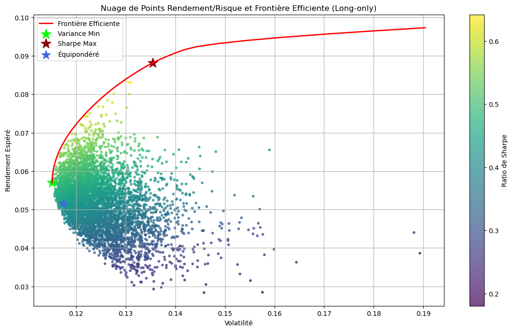

# Optimizing Moroccan Equity Portfolio with Monte Carlo Simulation

## 📊 Key Findings
- **Best Strategy:** Maximum Sharpe Portfolio (8.15% CAGR)
- **Worst Drawdown:** -29.36% (COVID-19 crisis)
- **Optimal Allocation:** ATW (45.5%), TQA (48.6%), MNG (6.0%)

## 📁 Repository Contents
- `TRADINGLIONS_Research.pdf` - Full research report
- `analysis_results.ipynb` - Analysis outputs (charts, tables, metrics)
- `/charts` - High-resolution figures

## 🔒 Code Availability
Full implementation code available upon request for:
- Academic collaboration
- TRADINGLIONS community members
- Institutional partners

**Contact:** saadallah2002@gmail.com / saadallah@tradinglions.io

## 📈 Preview

---
*Built with Python, NumPy, Pandas, Matplotlib, and Scipy*
